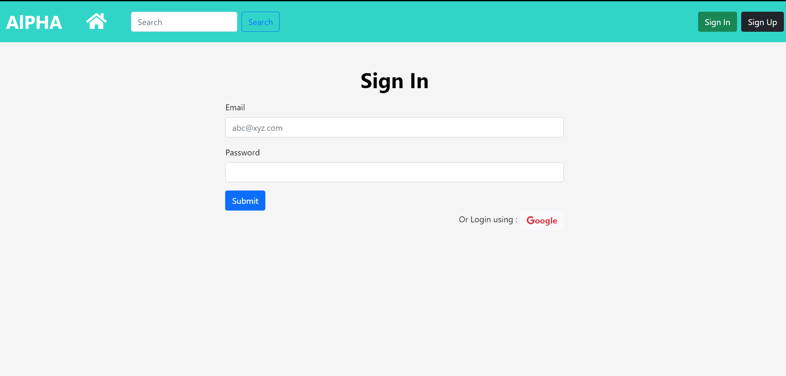
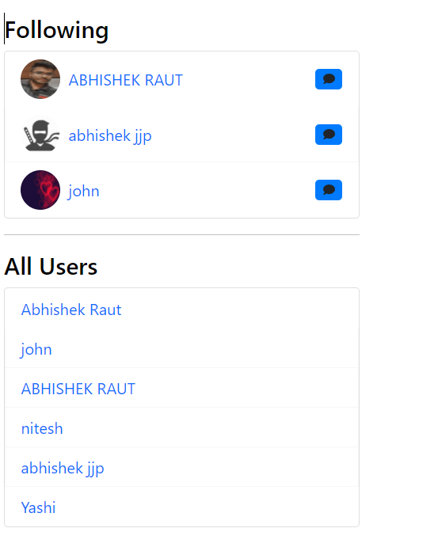
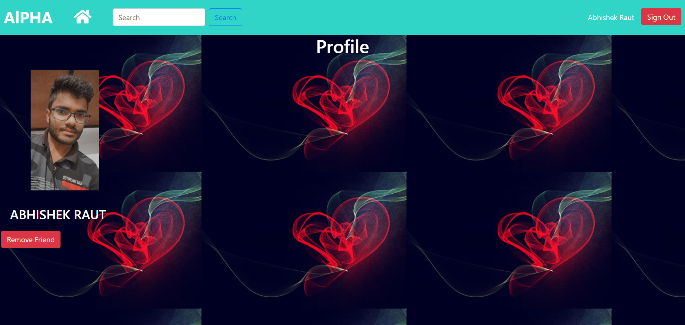
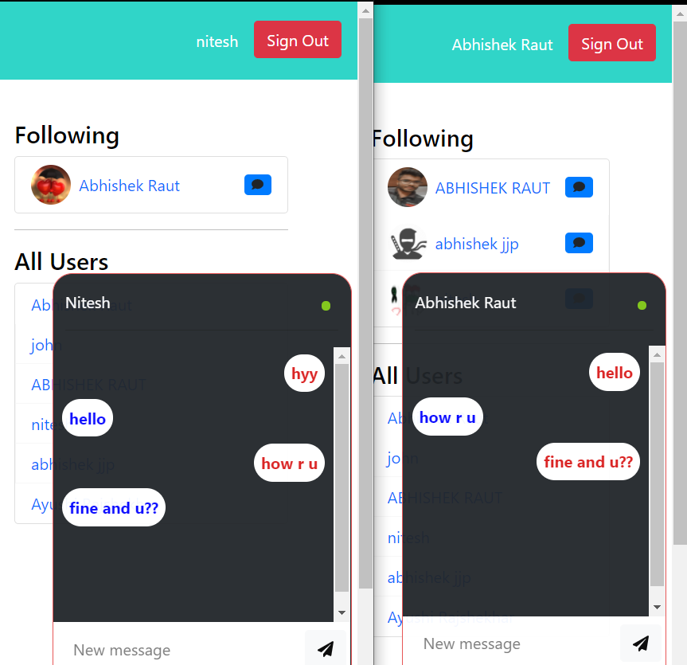

# Q&A Website
## How to Use
<ul>
  <li>
      Install NodeJs (nodejs.org).
    </li>
    <li>
   Install redis
    </li>
    <li>
    Fork, Clone and open this repository in a terminal/command prompt.
    </li>
  <li>
  Execute npm install.
    </li>
  <li>
Execute npm start.
    </li>
   <li>
 Open your preferred web browser and go to "https://localhost:8000" 
      
  </li>
</ul>

## Tools and Packages used

  
  
  
 
  
  

 

  
   
   

 
 

  1.Jquery
  

 2.Socket.io
  

  

3.Node.js
  

  
  

  

  4.MongoDB 
  

  

  5.Express.js
  

  

  6.JWT 
  

  

  7.SASS 
  

8.NodeMailer
  

9.Passport.js
  

## Screenshots
<h3>Sign-in</h3>

 

  

  <h3>home-Page after logIn</h3>
    

 

  

  
   <h3>Followers and all Users</h3>
    

 

  

  
   <h3>Profile</h3>
    

 
 

  

  
   <h3>Chat</h3>
    

 
 

  

